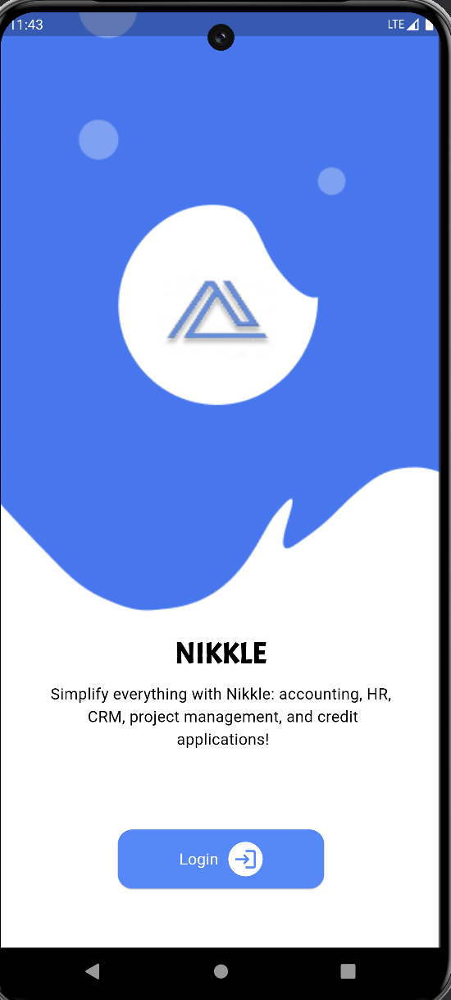
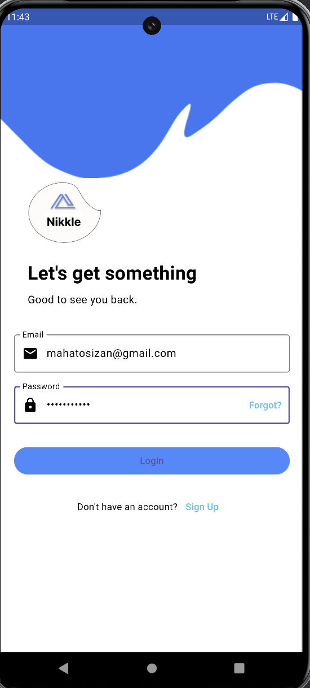
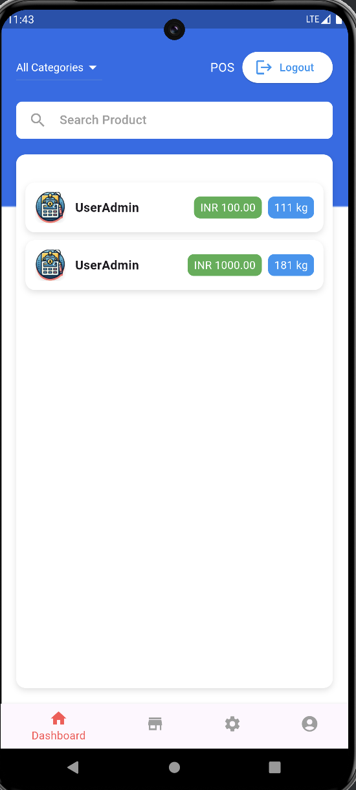
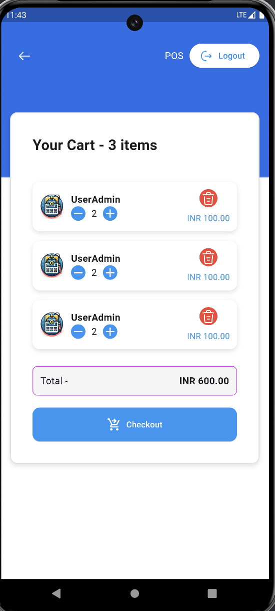
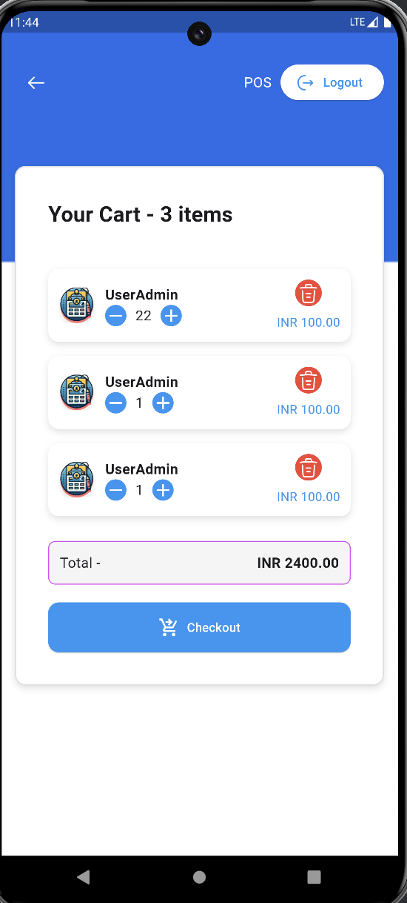

#  Flutter Application
 
## Project Structure 

lib
├── main.dart              # Entry point of the application
├── checkout.dart          # Checkout screen
├── login.dart             # Login screen
├── onboarding.dart        # Onboarding screen
└── navpages               # Folder for navigation-related pages
     ├── navbar.dart        # Custom navigation bar
     ├── homepage.dart      # Dashboard page
     ├── profile.dart       # Profile page
     ├── cart.dart          # Cart page
     └── setting.dart       # Settings page


## Features

- Custom navigation bar with four main pages: Dashboard, Profile, Cart, and Settings.
- Integrates Google Fonts for custom typography.
- Uses Iconsax for modern icons.
- Organized project structure for scalability and maintainability.

## Screenshots

| onboarding/ splash Screen                        | login Page                              |
|--------------------------------------------------|-----------------------------------------|
|  |  |

| HomePage                                     | cart                                 |
|----------------------------------------------|--------------------------------------|
|  |  |

| cart2                                  |
|----------------------------------------|
|  |


## Dependencies

This project uses the following Flutter packages:

- **google_fonts: ^6.2.1** - Allows you to easily use Google Fonts.
- **get: ^4.6.6** - Provides a powerful and lightweight state management solution.
- **iconsax: ^0.0.8** - A modern icon set with over 2000 unique icons.

To install these dependencies, add them to your `pubspec.yaml` file and run `flutter pub get`.

```yaml
dependencies:
  flutter:
    sdk: flutter
  google_fonts: ^6.2.1
  get: ^4.6.6
  iconsax: ^0.0.8
